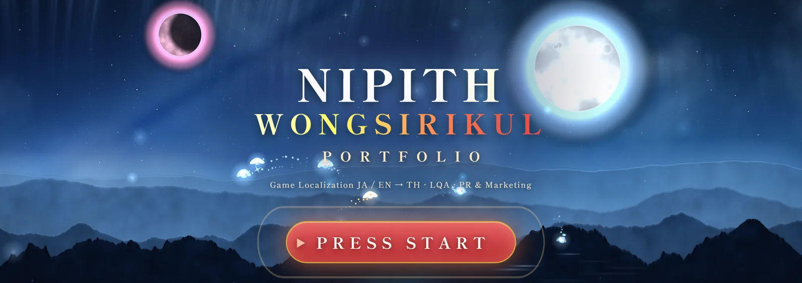
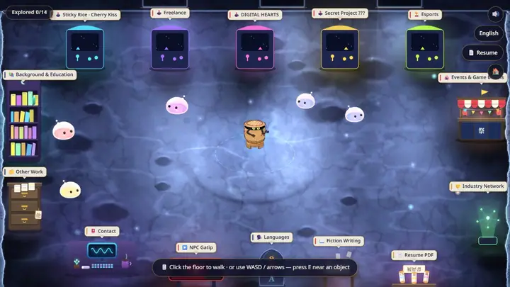
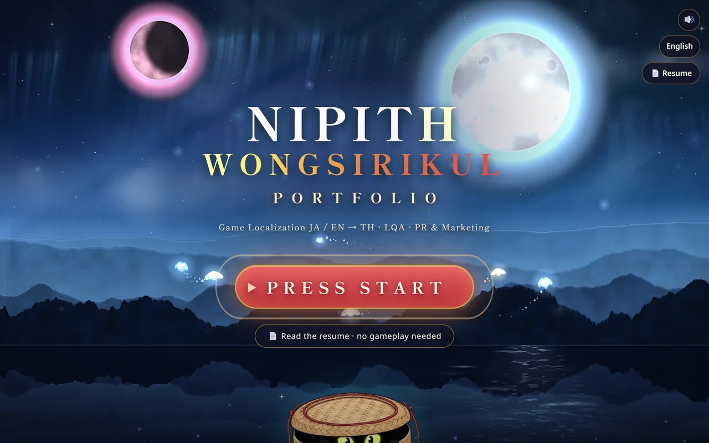
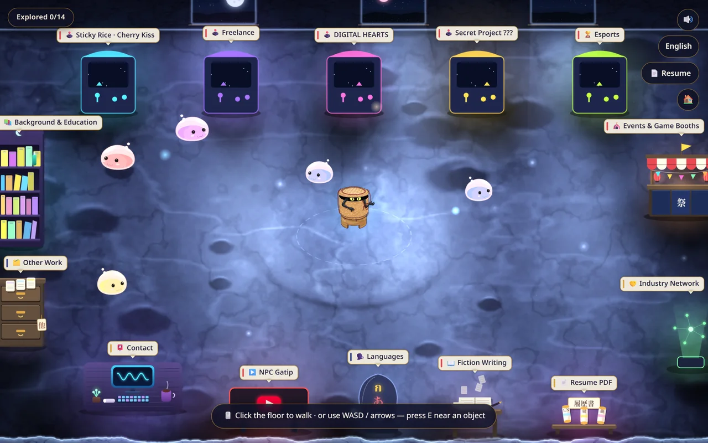
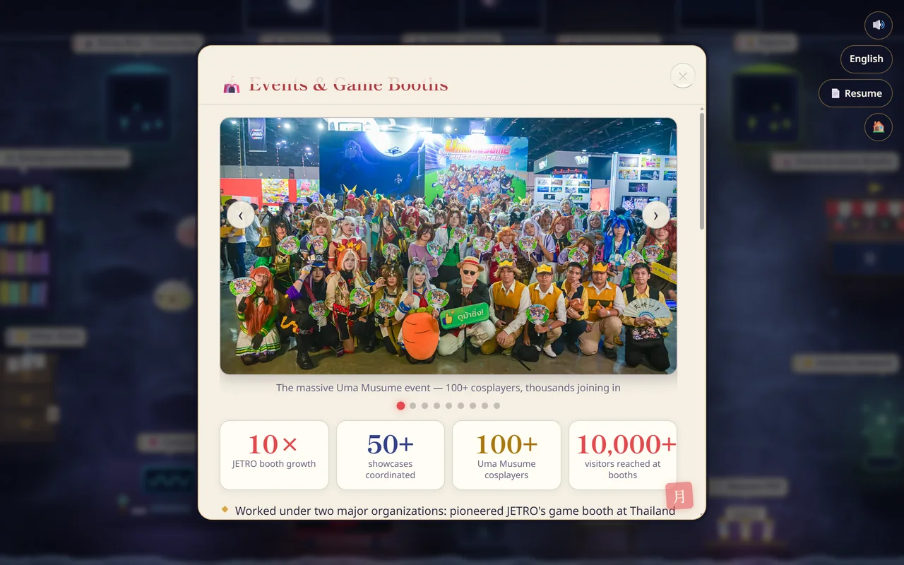
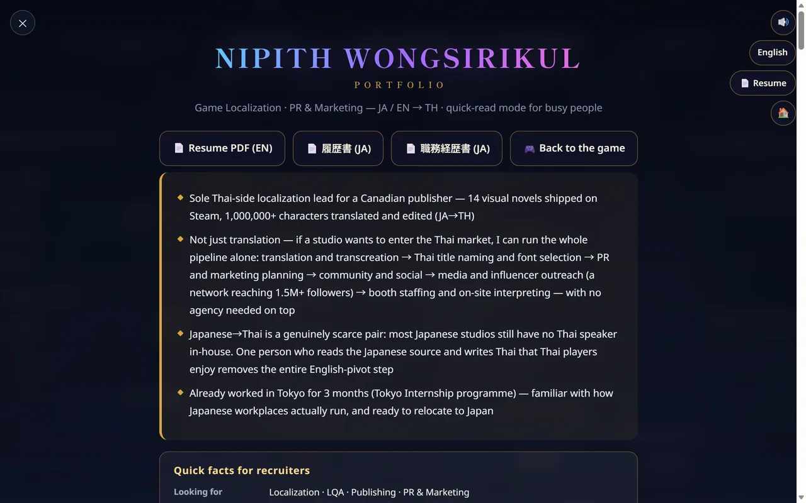
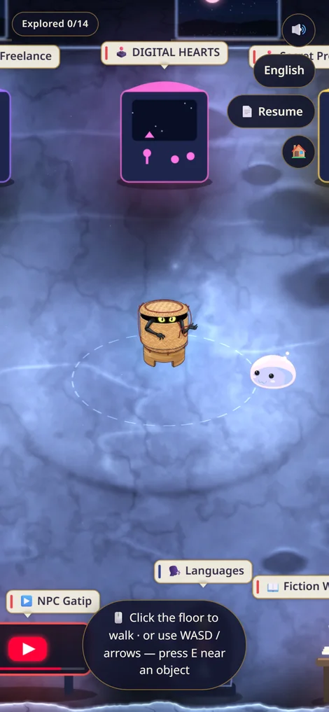

<div align="center">



[English](README.md) · [日本語](README.ja.md) · **ไทย**

### ▶ [**gatipnw.github.io**](https://gatipnw.github.io/) — เปิดเล่นได้เลยในเบราว์เซอร์

[](https://gatipnw.github.io/)


</div>

---

ผมชื่อ **นิพิธ วงศ์ศิริกุล (กระติ๊บ)** ทำงานสาย Game Localization ญี่ปุ่น/อังกฤษ → ไทย
แทนที่จะส่ง PDF ไปเฉยๆ เลยทำเกมเล็กๆ ที่เดินสำรวจได้ — ตู้เกม ชั้นหนังสือ และแผงลอย
ทุกชิ้นในห้องคือผลงานหนึ่งชิ้น

<div align="center">
  
  <sub>เดินเข้าหาตู้ → ป้ายสว่างขึ้น → กด <kbd>E</kbd> → ผลงานเปิดขึ้นมา · มีทั้งหมด 14 โซน</sub>
</div>

## ในห้องมีอะไรบ้าง

| | |
|:--|:--|
|  **หน้า Title** — สตูดิโออยู่ในดวงจันทร์ อินโทรจะพาบินเข้าไป |  **ห้องสตูดิโอ** — วัตถุกดได้ 14 ชิ้น ชิ้นละหนึ่งโซนผลงาน |
|  **Panel** — การ์ดกระดาษวาชิ มีสไลด์ ตัวเลข และลิงก์ |  **Resume Mode** — หน้า HTML เลื่อนอ่านปกติ สำหรับคนที่อยากอ่านอย่างเดียว |

<div align="center">
  
  <br><sub>จอสัมผัสมีจอยอนาล็อกลอยตามนิ้ว — รองรับตั้งแต่กว้าง 360px</sub>
</div>

## ทำไมถึงทำแบบนี้

**ตัวเว็บคือชิ้นงานพอร์ตเอง** — เรซูเม่สายแปลที่เขียนว่า "ใส่ใจรายละเอียดภาษา" ควรพิสูจน์ให้เห็นได้จริง
เว็บนี้เลยทำหน้าที่นั้น:

- **3 ภาษาแบบเป็นโลแคลจริง ไม่ใช่ภาษาเดียวแล้วแปะคำแปล** ข้อความทุกตัวอยู่ใน
  [`js/data/content.js`](js/data/content.js) กับ [`js/i18n.js`](js/i18n.js) ไม่มี hardcode
  ในมาร์กอัป · สลับจาก HUD แล้ววาดใหม่ทันทีรวมถึง panel ที่เปิดค้างอยู่ ไม่ต้อง reload ·
  จำภาษาไว้ใน `localStorage` และครั้งแรกเดาจาก `navigator.language`
- **ฉบับญี่ปุ่นรื้อโครงใหม่ ไม่ใช่แปลทับ** เวอร์ชัน ja ใช้ลำดับของ 職務経歴書 จริง —
  職務経歴 → 実績 → 活かせる経験・知識・技術 → 学歴 → コンタクト — ซึ่งคนละโครงกับฉบับไทย/อังกฤษ
  ลำดับหัวข้อเก็บเป็นข้อมูลรายภาษา (`resume.groups`) ไม่ได้ใช้เทมเพลตร่วม ·
  จุดนี้คือสิ่งที่อยากให้ HR ญี่ปุ่นเห็นที่สุด
- **ไม่บังคับให้เล่น** Resume Mode เป็น HTML เลื่อนอ่านปกติ เปิดได้ตั้งแต่หน้าแรก
  screen reader อ่านได้ และมี `@media print` ให้ Ctrl+P ออกมาเป็น PDF สะอาด
  (ไม่ใช่กระดาษดำทั้งแผ่น)
- **เอฟเฟกต์ตั้งต้นที่ "ปิด"** ทุกเอฟเฟกต์เช็ค `prefers-reduced-motion` โดยเวอร์ชันนิ่ง
  ถูกออกแบบให้สวยด้วยตัวเอง แล้วค่อยมีปุ่ม ✨ ให้คนที่อยากได้เอฟเฟกต์เต็มกดเปิดเอง

## เทคโนโลยี

HTML + CSS + **Vanilla JS (ES Modules) + Canvas 2D** ไม่มี framework ไม่มี bundler
ไม่มี build step และไม่มี dependency ตอนรันนอกจาก Google Fonts (ซึ่งมี fallback)
วางโฟลเดอร์บน static host ที่ไหนก็เปิดได้

คุมงบ 60fps ไว้ — `renderer.draw` วัดได้ **median 1.2ms · p95 2.1ms** ต่อเฟรม
(วัดผ่าน CDP ที่ 1416×761) กติกาที่ทำให้อยู่ในงบ:

- ห้ามใช้ `ctx.shadowBlur` ในลูปวาด — glow ทุกอันเป็นสไปรต์ที่เจนไว้ก่อน
- gradient ทุกอันอบครั้งเดียวตอนเริ่ม ไม่สร้างใหม่ต่อเฟรม
- ไม่สร้าง object/array ใหม่ทุกเฟรม · มี `requestAnimationFrame` ลูปเดียวคุมด้วย delta time
- แท็บถูกซ่อนเมื่อไหร่ ลูปหยุดสนิท

ฉากกลางคืน แสงในห้อง สไปรต์ และสไลด์ผลงาน เจนด้วยสคริปต์ Python ใน [`tools/`](tools/)
ทั้งหมด (numpy + pillow, ล็อก seed) รวมถึงภาพใน README นี้ด้วย —
[`tools/gh_media.py`](tools/gh_media.py) สั่งเบราว์เซอร์ headless ผ่าน CDP ไปจับแบนเนอร์
ภาพนิ่ง และคลิปด้านบนมาจากตัวเกมจริง

## ทำยังไง และใครทำอะไร

ขอบอกตรงๆ ไว้ตรงนี้ก่อน ดีกว่าปล่อยให้เข้าใจไปเอง — **โค้ดเขียนโดยมี Claude (Anthropic)
เป็นคู่เขียนโปรแกรมหลัก** ผมเป็นคนสายโลคัลไลเซชัน ไม่ใช่วิศวกรซอฟต์แวร์
และการทำพอร์ตที่ขายเรื่อง "ฝากคำพูดของคนอื่นไว้กับผมได้" แล้วมาอ้างว่าเขียนเองทุกบรรทัด
มันขัดกันเองตั้งแต่ต้น

ส่วนที่เป็นของผม:

- **คอนเซ็ปต์และทิศทางอาร์ต** — สตูดิโออยู่ในดวงจันทร์ · ชุดสีราตรีญี่ปุ่น คราม–วาชิ–ชาด–ทอง ·
  เลือก HD-2D ไม่เอา isometric · และการตัดสินใจว่าปัญหา "ห้องดูไม่มีความว้าว"
  ต้องแก้ด้วย**แสง** ไม่ใช่เพิ่มของตกแต่ง
- **การตัดสินใจดีไซน์และการสั่งแก้ทุกรอบ** — ถอด god rays หลังโลโก้ · ถอดเงาใต้ตัวละคร ·
  โปริ่งเอาตัวใหญ่ 5 ตัวไม่เอาตัวเล็ก 9 ตัว · เลิกใช้หลอดพลังภาษาเปลี่ยนเป็นการใช้งานจริง ·
  ตู้อาร์เคดเวกเตอร์เก็บไว้
- **ข้อความทั้งหมดครบ 3 ภาษา และการตรวจความถูกต้อง** — รวมถึงการยืนยันให้เขียนในโซน esports
  ว่าแพ้ทีมโปรทุกทีม เพราะความจริงเป็นแบบนั้น
- **การเทส** ผมเล่นเองแล้วแจ้งกลับว่าอะไรพัง: การควบคุมไม่สมูท · คลิกแล้วเดินค้าง ·
  ภาพมัว · โปริ่งกระโดดทับเฟอร์นิเจอร์ · ตัวหนังสือสีหมึกบนพื้นครามอ่านไม่ออก ·
  เลย์เอาต์มือถือแตก — ตีกลับจนกว่าจะแก้จบ

ส่วนที่ Claude ทำ: แปลงการตัดสินใจพวกนั้นเป็น JavaScript กับ Python และหาสาเหตุของบั๊ก
ที่ผมแจ้งไป

การตัดสินใจทุกอย่างในโปรเจกต์นี้เป็นของผม ส่วนที่แบ่งกันคือการพิมพ์

## โครงสร้าง

```
index.html · css/style.css
js/     main.js · i18n.js · audio.js
        engine/  camera · input · collision · particles · renderer
        world/   player · objects · map
        ui/      title(intro) · panels · resume
        data/    content.js   ← เนื้อหาครบ 3 ภาษาอยู่ที่นี่ที่เดียว
assets/ ภาพ · เสียง · PDF (เจนด้วย tools/)
tools/  สคริปต์ Python เจนฉาก สไปรต์ โลโก้ สไลด์ และสื่อสำหรับ README
```

## รันในเครื่อง

```bash
python tools/serve.py     # → http://localhost:8123
```

## เครดิต

- เพลงประกอบ: **"3:03 PM" — しゃろう (Sharou)** ใช้ตามเงื่อนไขการใช้งานที่ศิลปินกำหนด
- โลโก้บริษัท/องค์กรที่ปรากฏเป็นเครื่องหมายการค้าของเจ้าของนั้นๆ แสดงเพื่อระบุผลงานที่เคยร่วมงานเท่านั้น
- โค้ดเป็น MIT ส่วนข้อความ ภาพ และข้อมูลส่วนตัวไม่ใช่ — ดู [LICENSE](LICENSE)
